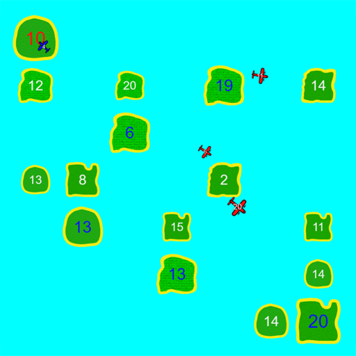

# Archipelago

A 2-player web-based clone of the [android game](https://play.google.com/store/apps/details?id=com.sgg.archipelago_kr) 
with the same name.



The game can be played at https://playarchipelago.com.

## The Archipelago game

The game is about controlling islands by sending airplanes. Each players starts controlling a single 
island. In addition, there are multiple islands, controlled by neither of the two players. Each 
island has an army, that for player-controlled islands increases over time. A player may at anytime 
choose to send an airplane from an island that the player controls to any other island. The airplane 
is created with half the army strength of the island, subtracted from the island.

As an airplane reaches its destination different things happen:
  1. If the owner of the airplane is the same as the owner of the island, then the island strength is 
  increased by the strength of the army on the airplane.
  2. If the owner is not the same, then the army size of the island is subtracted by the army size of 
  the airplane. This in turn can have additional effects:
     1. If the resulting island army size is `<0`, then the player controlling the airplane gets 
     control of the island and the army size of the island is set to the absolute value.
     2. If the resulting island army size is `== 0`, then control of the island is given to the 
     neutral player.

The game is over when a player no longer controls any islands or airplanes.

## Project Overview

The project has two parts; A backend server written in go, and a frontend created in JavaScript. 
Communication between the backend and frontend is done over JSON-encoded WebSockets messages.

### Frontend

The frontend project is found in the [static](./static) directory. It is based on [Pixi.js](https://github.com/pixijs/pixi.js) 
for WebGL/canvas rendering, and relies on [JSPM](jspm.io) for package management. The frontend
is written in ES6, and is transpiled to ES5 via Babel (handled by JSPM). 

### Backend

The backend is written in go and uses [Godep](https://github.com/tools/godep) for managing 
vendor dependencies. The backend relies primarily on the go standard library, but 
uses [Gorilla/WebSocket](https://github.com/gorilla/websocket) for WebSocket handling, 
[Logrus](https://github.com/Sirupsen/logrus) for logging, and [pkg/errors](https://github.com/pkg/errors) 
for better error handling. 

The backend code is found in the [lib](./lib) directory.

## Running the Project

To run and build the project, make sure to have the following installed:
* [Go](https://golang.org/dl/)
* [Node.JS](https://nodejs.org/en/download/)

Then download the project to your `GOPATH`:
```
$ go get github.com/verath/archipelago
```

This will include all dependencies required for the backend code. However, the client 
side dependencies are not included in the repo and have to be fetched via npm and built
to an `app.build.js` file:

```
$ cd $GOPATH/src/github.com/verath/archipelago/static
$ npm install
$ npm run build:prod
```

Now run the project as a go project, e.g. using `go run` from the root directory:

```
$ cd $GOPATH/src/github.com/verath/archipelago
$ go run main.go -debug -servestatic
```

This should start the server, and make it available at 
[http://localhost:8080](http://localhost:8080) by default.

### Production

There are obviously many ways to run a project in a production environment.
An example configuration used for the host running the [playarchipelago.com](https://playarchipelago.com)
domain is provided in the [config](./config) folder.
